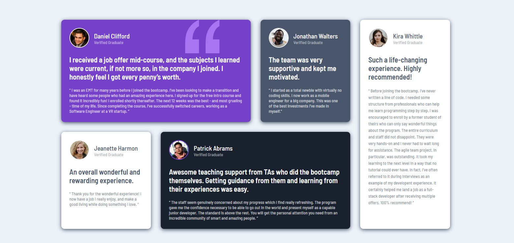

## Table of contents

- [Overview](#overview)
  - [Screenshot](#screenshot)
  - [Links](#links)
- [My process](#my-process)
  - [Built with](#built-with)
  - [What I learned](#what-i-learned)
  - [Continued development](#continued-development)

## Overview
Page with the optimal layout for the site depending on their device's screen size.

### Screenshot

### Links
- [Solution URL here](https://github.com/KamilaHareza/Testimonials-grid-section)
- [Live site URL here](https://kamilahareza.github.io/Testimonials-grid-section/)

## My process

### Built with
- HTML5
- CSS
- Flexbox
- CSS Grid

### What I learned
This project helped me understand the usage of CSS Grid, especially with different screen sizes. I could use media queries to make sure that the page will present nicely on every device. The tricky part for me was figuring out what to do with a quote image, so it won't cover any text in the first card.

### Continued development
I want to start incorporating Java Script and work on understanding CSS pseudo-elements in my future projects, to become comfortable with them. Because I enjoyed working with CSS Grid in this project, I hope to use it again while creating a more complex landing pages.
